### 使用静态代码工具,实现高质量代码编写

点击链接可收听音频,但还是建议阅读文字比较好 ,阅读是一个思考的过程

[使用静态代码工具,实现高质量代码编写](https://www.lizhi.fm/3688152/2608369156415022598)

### 前言

对于少量的代码,我们通常能够通过肉眼或者代码编辑器,甚至控制台出现的错误,找出对应有问题的代码行,可以进行排错,但是若是对于大量的代码,光靠肉眼的识别,少则几百行,多则上千行的代码,光靠眼力劲来察觉bug,整个工作量是非常大的,也很难预测,特别是某些库(比如jQuery等)或者产品的迭代开发时,随着代码越来越庞大,根本不适合所谓的眼力劲来找出代码中潜在的错误,那么这时候在运行代码之前,使用代码分析工具进行检测,那就非常友好了,静态分析工具能够发现代码中常见的出错因素和陷阱并进行提示,从而可以避免有bug的代码被执行,使用该工具可以发现代码中语句结束时是否缺分号,使用了未定义的变量,以及语法错误,更为重要一点是,如果你使用了javascript中eval方法将字符串转换js代码来执行,他也会对代码进行安全提示的检查,只要确定这些有潜在风险的代码操作,没有在你的源码中出现,就能够减少程序中Bug,自己写的代码也更加有信心,而在非正规军的团队开发中,也许本身就没有静态代码分析这一环节,很多时候,绝大部分都是以业务为导向的,无论你代码写得有多么low,只要能跑起来,实现了就行,对于代码的质量和潜在的问题并没有过多的在意,自己挖的坑,让别人来填补,这是平时开发当中常有的事,使用这些工具本身就是非硬性的,因人而异,但是我觉得一个强悍的团队的leader,保证各个小伙伴写出更规范,更高效的代码,使用这些代码软技能无论是对人对己,还是对产品都是很有利的,无论别人是否要求,为了自身优质代码的输出,习以为常的应用这些代码软技能也是自我很好的提升,对于前端开发的小伙伴来说,或许平时使用单元测试不是很多,更多什么单元测试在后端逻辑进行单元测试是比较多的,自己一直都想跃跃欲试,最近接触学了一下这个,今天就我的学习和使用,跟大家分享一下使用心得,实现高质量代码的编写,如果您已经是老司机了,也许不适合你了,也欢迎路过的老师多提意见和指正

>### JSLint

* 能够代码发布之前对代码进行检查校验,发现代码中那些已知的错误(语法检测,规范,潜在的风险检查),确保项目遵循的代码规范
* 在线工具地止[JSLint](http://www.jslint.com "jslint静态代码检查")

> ### 在线测试代码
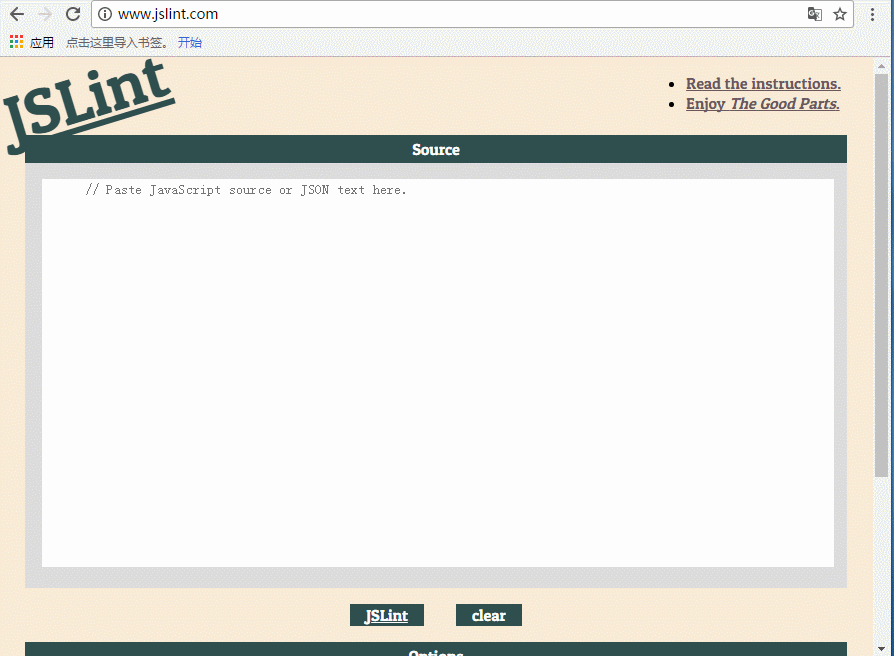
* 使用方法:直接`拷贝js代码`到检测框中,然后`点击JSlint`,便可得出结果,但是你却发现,看到红色的错误提示框,简直不能忍,JSlint严格的对代码的格式做出了检查,空格,符号之类的统一的进行了检测
* 代码错误如下所示
    * 意外的空格(函数后面)
    * 使用未定义的类对象
    * 没有用严格的"use strict"语句来强制来使用
    * 使用空格,而不是制表符
    * 变量名以下划线
    * alert方法未定义就被调用(之所以被标识未错误,是因为alert不是官方js语言规范的一部分,它是浏览器添加一个功能调试弹出框信息而已)
* 针对JsLint复选框进行选择,通过这些复选框针对自己的代码,对默认的一系列规则进行修改,比如标识符开头的下划线以及空格,this,Es6等勾选了,就相当于设置了true,设置完成后代码的错误就变少了,如下gif所示
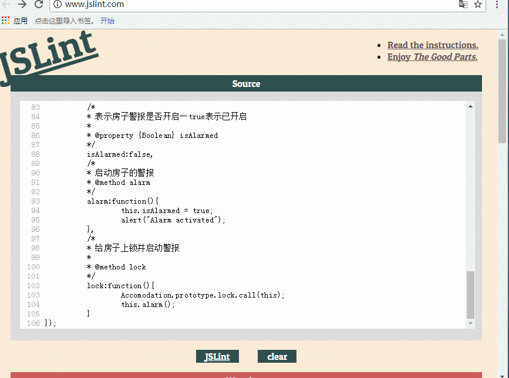
* 可以在代码中对不同的文件设置不同的规则,方法是将这些指令放在文件的顶部,以/*jslint开头,后面跟着一系列的选项,JSlint在分析js代码时会应用这些选项,选项后面可以是true,也可以是false,指明该选项是否启用,多个选项之间用逗号隔开(也可以勾选浏览器下方的选项,默认为false,勾选状态为true),照错误提示:在代码中添加"use strict" 增加严格模式 ,示例代码如下所示:

```
/*jslint devel:true,nomen:true,white:true*/
/*global Class:false*/
var Accomodation  = Class.create((function(){
	  "use strict" // 使用严格模式,在这个函数作用范围内都会生效
	  var _isLocked = true,
	  	  publicPropertiesAndMethods = { 
	  	 	  lock:function(){
	  	 	  	 _isLocked = true;
	  	 	  },
	  	 	  unlock:function(){
	  	 	  	 _isLocked = false;
	  	 	  },
	  	 	  getIsLocked:function(){
	  	 	  	 return _isLocked;
	  	 	  },
	  	 	  initialize:function(){
	  	 	  	 this.unlock();
	  	 	  }
	  	 };
	  	return publicPropertiesAndMethods; 
}()));
var House = Accomodation.extend({
	  isAlarmed:false,
	  alarm:function(){
	  	  this.isAlarmed = true;
	  	  alert("Alarm activated");
	  },
	  lock:function(){
	  	  Accomodation.prototype.lock.call(this);
	  	  this.alarm();
	  }
});
```
`缺点`:
   * 因为比较严格,对于一些无关痛痒的问题也会视作为bug,用jslint来检查代码并不是很方便,会增加工作量,也会对自己代码产生疑问
   * 缺乏文档记录规则
   * 有限的配置选项,许多规则不能禁掉
  
这只是线上进行检查,对于非线上的,针对Node.js应用框架有JSlint工具,可以通过终端命令行的方式来运行jsLint版本,使用方法如下:
* 下载安装nodejs(针对电脑系统位数下载对应的版本,分32为和64位,还有mac版本的)
* 安装JSlint到机器当中去,`npm install jslint -g`全局进行安装
* 切换到对应检查的源文件下执行`jslint  XXX.js`或者`jslint *.js`进行检查
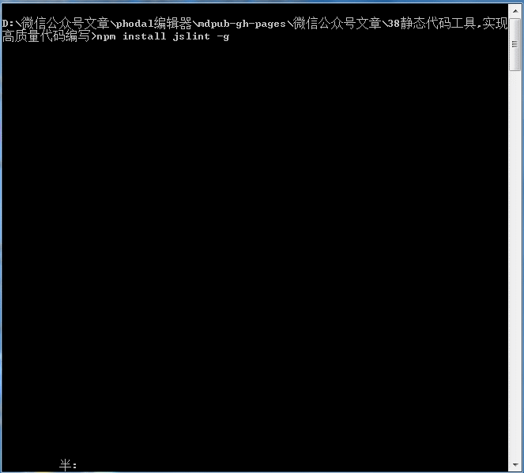

> ### JSHint

* 同上,代码分析工具,可对代码进行检查校验,但是没有jslint严格,主要是针对语法错误,而不是内容格式,以及那些可能使代码不能正确运行的错误,而不应该因为某些格式上的问题,使代码不通过检查
* 不同点:忽略function关键字后面的空格以及双大括号之间的空格
* 对于没有用到的变量,会产生一个错误,也可以设置参数配置进行过滤该错误,配置与jslint相似,如下所示:`/*jshint devel:true,unused:false*/`,完整的选项列表很长,可以通过在线文档的方式来获取,如下网站所示:[jsHint](http://jshint.com/docs/options "jsHint在线官方文档")
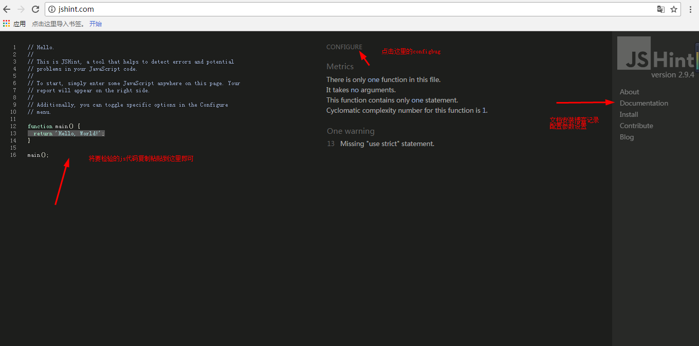
* 使用Node.js坏境下检测一样,需在nodejs的环境下,用npm安装jsHint，然后在dos命令行下执行`jshint xxx.js`或者`jshint *.js`(对所有的js进行检查)如下操作所示
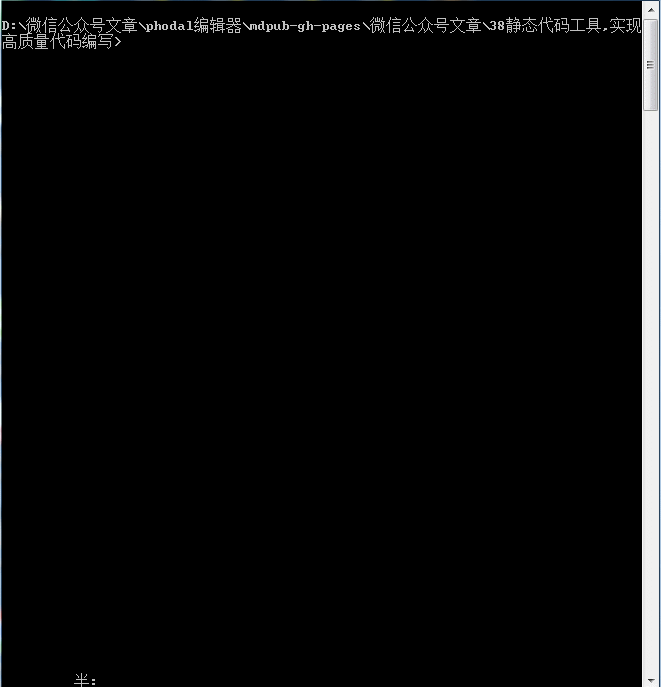

>### ESlint

* 同上,代码校验工具检查
* ESLint不仅可以进行代码风格的检验,而且可以检查代码中的bug和其他问题
* 对于ES6,ESLint也是明智的选择,在上面提到jslint,jsHint工具中,ESLint对ES6支持的最为友好广泛
* 中文文档[Eslint](http://eslint.cn/docs/user-guide/configuring “Eslint中文文档”)
* 英文文档[Eslint](http://eslint.org/ "Eslint英文文档")
`优点:`
* 不依赖于具体的编码风格
* 内置规则和自定义规则共用一套规则 API
* 每条规则,各自独立,可以开启或关闭,可以将结果设置成警告或者错误
* ESLint 并不推荐任何编码风格,规则都是自由的
* 通过丰富文档减少沟通成本,尽可能的简单透明,测试的重要性

>### 使用方法

* 在线使用,复制粘贴代码到检测框中,可对代码进行检查,使用如下gif所示
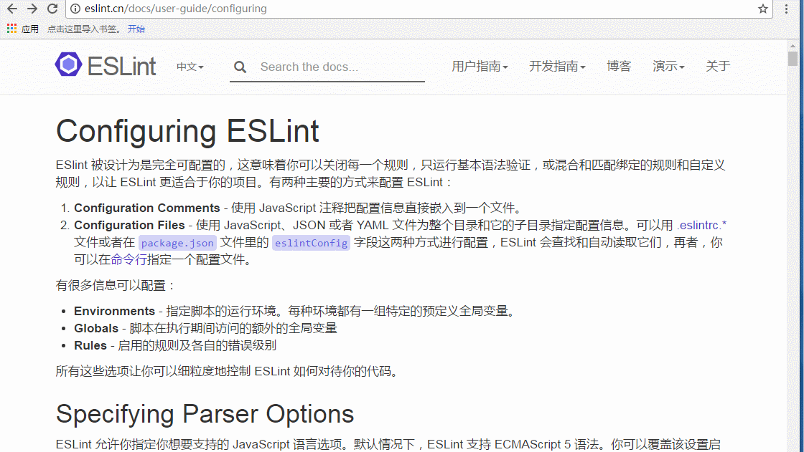
* 推荐使用命令行工具使用Eslint,安装Nodejs,安装Eslint
*安装eslint   `npm i -g eslint`
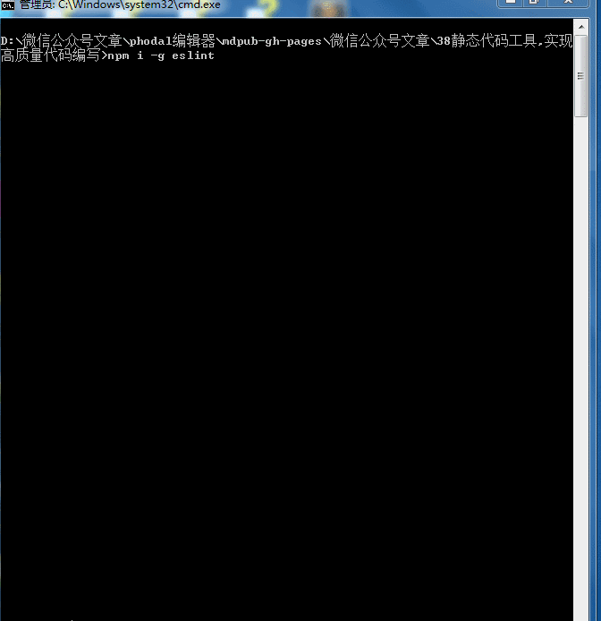
* 在用eslint对源代码进行检查之前,先要初始化eslint --init初始化,按照提示,支持Es6,commonJS,React等选择,执行完后,执行`eslint  xxx.js` 可在终端上查看到具体的错误提示
* 具体的每个命令配置参数,可结合官方文档进行逐一查看
  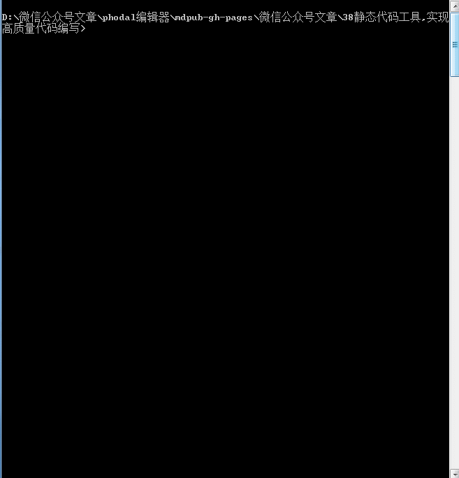
如上为eslint 检测示例代码所示

### 小结
`JSlint`,`jsHint`,`ESlint`比较
* 优先选择Eslint,文档齐全(中英文都有),况且很多自动化构建工具webpack等都集成了Eslint等代码检查工具,令人麻烦一点就是配置参数,设置状态,具体得还是得紧跟官方文档,只要耐下心来,通读一遍,若有不懂,Google,stackoverflow,github,博客园,百度等关键字进行搜索嘛,总有满意的答案,`jsHint`是第二选择,它对代码的语法进行检查,忽略代码格式,最后考虑使用`jslint`,不是说它不好,只是觉得太过于严格,眉毛胡子一把抓的感觉,对一些代码格式也强行限制了,若想要去除一些非语法错误,还得自行配置

>### javascript中的单元测试

上面的静态代码分析工具能够检测出代码中存在的错误,如果想要更进一步的对代码进行分析,那么就需要进行`单元测试`了，把代码中每个函数都写成一个具有独立的功能单元,这个单元有输入和输出,并执行一个 明确,有文档说明的操作,那么测试也就是这个javascript函数,它要做的是用不同的输入依次执行你写的每个函数,然后检查函数的输出是否符合预期值
`如下示例代码`

```
var add  = function(){
	var total = 0,
	len = arguments.length;    	      	       
	for(var index = 0;index<len;index++){
	     total+= arguments[index];
	}
	return total;
}
console.log(add(1,2,3,4,5));  //15
```
控制台输出结果
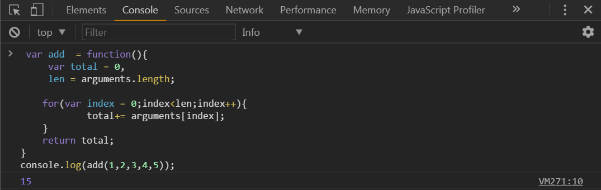

针对函数的设计单元测试要用不同的输入来执行这个函数,比如说空值,非number数值等进行测试这样能够保证该函数的行为符合预期,而且对于不同的输入组合能够输出正确结果,在有些时候,当我们想要得到某些特殊值的时候,我们还会进行判断,对得出结果进行过滤,筛选,通过对代码中的每个函数进行严格的测试,能够确保代码少出问题
如下代码对结果进行条件判断:

```
var add  = function(){
	var total = 0,
	len = arguments.length;
	for(var index = 0;index<len;index++){
	    total+= arguments[index];
	}
	if(isNaN(total)){
	    console.log("请输入正确的number值");
	}else{
       return total;
	}
	/*
	if(typeof total === "number"){
		return total;
	}else{
        console.log("请输入正确的number值");
	}
	*/  
}
console.log(add("asdfs"));  // 请输入正确的number值
```
控制台输出测试输出结果
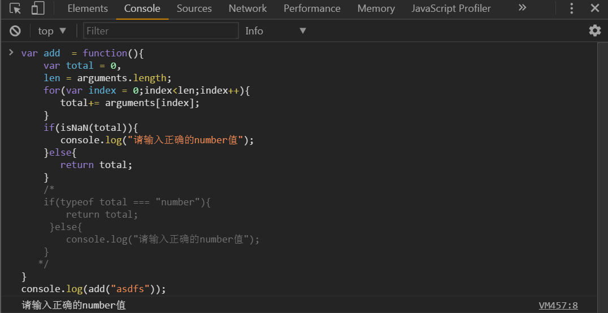

> ### javascript单元测试框架

可以手动编写代码挨个的进行单元测试,但是很多时候,已经有现成的测试框架供我们使用
* Qunit [https://qunitjs.com/](https://qunitjs.com/)
    * [Qunit-cookBook中文版](http://zeng.li/2012/11/07/Qunit-Cookbook-Zh/)
    * [张鑫旭大神边译边学Quint自动化单元测试](http://www.zhangxinxu.com/wordpress/2013/04/qunit-javascript-unit-test-%E5%8D%95%E5%85%83%E6%B5%8B%E8%AF%95/)
    * [Quitgithub](https://github.com/qunitjs/qunit) star:3636
* [Mocha](https://github.com/mochajs/mocha/)  star:12583
   * [测试框架Mocha教程](http://www.ruanyifeng.com/blog/2015/12/a-mocha-tutorial-of-examples.html)
* [jasmine](https://jasmine.github.io/) star:12545
  * [jasmine中文指南](http://ju.outofmemory.cn/entry/134373)
 * [jasmine测试框架](http://keenwon.com/1191.html)

>### jasmine(茉莉花)使用

上述的框架有兴趣的话,可以依次的进行测试学习的,至于单元测试的框架很多,我觉得你可以通过star数来自行判断,选择最多的那个,也是最流行的那个,使用的人多,文档也是最多的,工作方式都比较类似,都需要三个文件
* 首先包含框架本身代码的javascript库文件,这个库文件需要在HTML页面中使用,只要在这个HTML页面中引用这个框架库文件即可
* 另外还需要一个包含一个测试的Javascript代码的文件,以及包含单元测试的文件,当用浏览器打开这个HTML页面时,这些单元测试就会被自动执行,并将详细的执行结果输出,包括通过的测试和失败的测试,都会显示在屏幕上
`官方文档`
GETSTARTED-->JASMINE FOR NODE.JS-->MORE INFORMATION
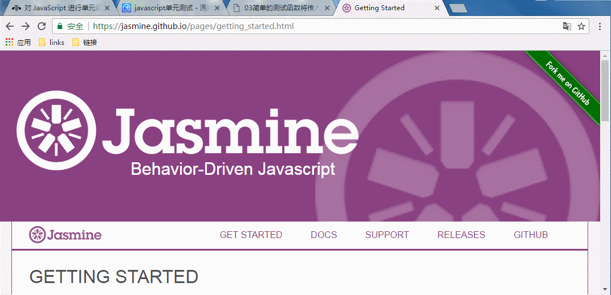
>### jasmine单元测试

* 将针对某个函数或者方法的一系列单元测试组织到一个组中,然后不同的单元测试组又可以被进一步组织在一块,这样彼此相关的代码就可以一起测试,这样一组单元测试称为一个测试套件(text suite),而单独的测试被称为规格(spec)
* 一般来说代码库中的每个文件都会有一个与之对应的测试套件文件,这些测试文件可以组织到一个单独的文件夹中,一般这个文件夹命名为spec
* 测试套件与相关代码文件相同的文件名,并在测试套件文件名后面加上-spec来区别,表示是测试套文件,比如相关代码文件为`xxx.js`,那么与之对应的测试文件可以命名为`xxx-spec.js`
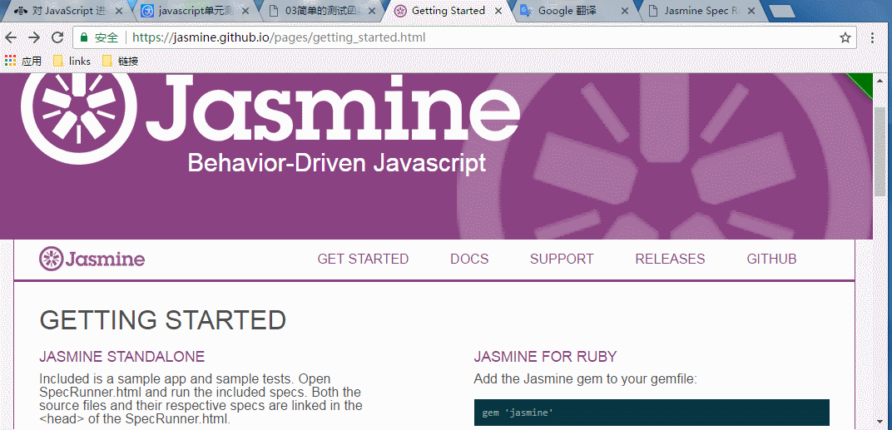
示例代码测试套件文件如下所示

```
describe("The add function", function() {
    it("Adds 1 + 2 + 3 together correctly" , function() {
        var output = add(1, 2, 3);
        expect(output).toEqual(6);
    });

    it("Adds negative numbers together correctly", function() {
        var output = add(-1, -2, -3);
        expect(output).toEqual(-6);
    });
});
```
上面的示例代码中使用jasmine的describle()函数,并通过对该函数将针对add()函数的所有单元测试几种在一个组中，describle()函,第一个参数为描述`the add function`，用来对这一组测试进行描述,第二个参数为回调函数,每个测试被包装在一个单独的匿名函数当中,每个单元测试都是用jasmine的it方法来定义的,其中同样第一个参数包含一个字符串来对单元测试进行描述,该测试函数还包含了对add()函数的一次调用，最后用jasmine的export()函数对返回值进行检查,expect函数后面跟着toEqual()函数的链式调用,这个函数就是一个匹配器，匹配器是一个jasmine函数,能够检查被测试函数的输出，并与预期的结果进行比较,看两者是否相匹配
`测试代码如下所示`

```
<!DOCTYPE>
<html lang="en">
<head>
  <meta charset="utf-8">
  <title>Jasmine Spec Runner</title>
  <link rel="stylesheet" type="text/css" href="lib/jasmine-1.3.1/jasmine.css">
  <script type="text/javascript" src="lib/jasmine-1.3.1/jasmine.js"></script>
  <script type="text/javascript" src="lib/jasmine-1.3.1/jasmine-html.js"></script>

  <!-- include source files here... -->
  <!-- <script type="text/javascript" src="src/Player.js"></script>
  <script type="text/javascript" src="src/Song.js"></script> -->
  <script type="text/javascript" src="spec/add.js"></script>
  <script type="text/javascript" src="spec/add-spec.js"></script>

  <!-- include spec files here... -->
  <!-- <script type="text/javascript" src="spec/SpecHelper.js"></script>
  <script type="text/javascript" src="spec/PlayerSpec.js"></script> -->
 

  <script type="text/javascript">
    (function() {
      var jasmineEnv = jasmine.getEnv();
      jasmineEnv.updateInterval = 1000;

      var htmlReporter = new jasmine.HtmlReporter();

      jasmineEnv.addReporter(htmlReporter);

      jasmineEnv.specFilter = function(spec) {
        return htmlReporter.specFilter(spec);
      };

      var currentWindowOnload = window.onload;

      window.onload = function() {
        if (currentWindowOnload) {
          currentWindowOnload();
        }
        execJasmine();
      };

      function execJasmine() {
        jasmineEnv.execute();
      }

    })();
  </script>
</head>
<body>
</body>
</html>
```
这里使用的是jasmine的1.3.1版本的,按照如上gif操作找到对应的版本进行下载即可,找到一个SpecRunner.html的示例文件,直接打开即可，把你自己要测试的源码xxx.js文件和测试套件放在spec目录里面,在html页面中直接引入即可,在浏览器中打开html文件即可,会自动的运行这些单元测试,然后再浏览器上输出结果,从浏览器的结果中显示出可以看出,对于给定的两个单元测试结果都符合预期,浏览器中输出结果为绿色的,表示的是正确的
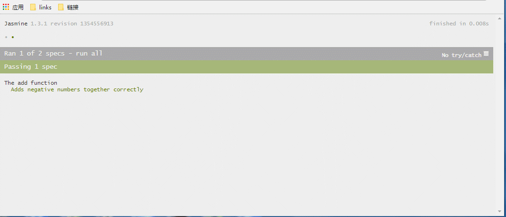
* 针对如上代码add()函数进行单元测试
* 针对add()函数输入空值的情况,还有非空值的情况,对于前者,希望在没有输入的时候输出为空,对于后者,希望将输入中的数值输入进行加和,并且忽略输入中的非数值部分
示例代码如下所示
```
describe("The add function", function() {
    // 第一个单元测试
    it("Adds 1 + 2 + 3 together correctly", function() {
        var output = add(1, 2, 3);
        expect(output).toEqual(6);
    });
	// 第二个单元测试
    it("Adds negative numbers together correctly", function() {
        var output = add(-1, -2, -3);
        expect(output).toEqual(-6);
    });
	// 第三个单元测试
    it("Returns 0 if no inputs are provided", function() {
        var output = add();
        expect(output).toEqual(0);
    });
    // 第四个单元测试
    it("Adds only numeric inputs together", function() {
        var output = add(1, "1", 2, "2", 3, "3");
        expect(output).toEqual(6);
    });
});
```
将上面的代码单独为一个js脚本文件引入到SpecRunner.html中去,在浏览器打开
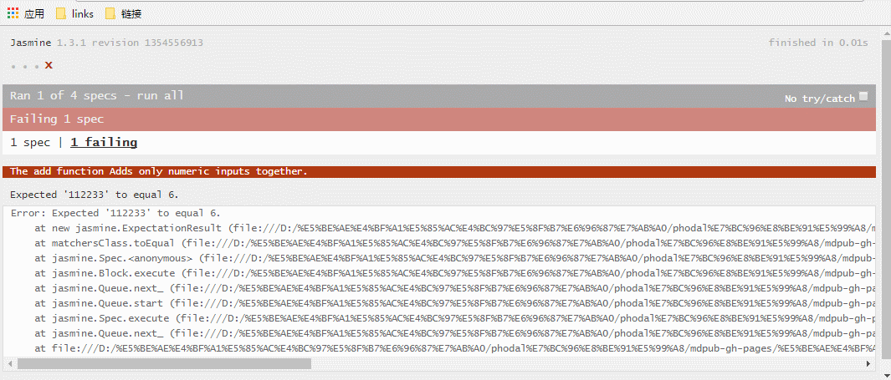
对于前三个单元测试给出的条件与结果符合,测试成功,而最后一个单元测试不通过,浏览器标识为红色,从浏览上jasmine版本下方的四个圆点点,其实就是对应的每个单元测试的结果,如果为绿色,那么表示成功,反之失败,会用红色的X表示,关于失败的具体原因,点击失败处的链接会给出提示，我们预期单元测试的结果函数输出应该是6但是实际输却为112233,其实它输出是一个字符串(其实不测试也很好理解一个数字加上一个字符串肯定是字符串,在没有对数值进行转换类型的话,肯定是字符串)

`小结`
上述例子很简单,其实不用单元测试,自己也能够进行判断,只是为了作为单元测试演示jasmine是怎样进行单元测试的,单元测试暴露出代码中存在的一些潜在的问题,这些问题可能导致在真实网页中运行时发生错误,所以我们要回到自己写的源代码中进行修正,加条件判断进行过滤筛选,检查输入的参数是否为数字,如果是的话,那么输出正确的值,不是的话,给出一个友好的用户提示,至于一些条件则具体根据实际情况的业务走,当然也这其中也包括编码经验,总之,使用单元测试能够很好的保证代码的健壮性,在复杂的业务的逻辑处理中,使用单元测试还是很有必要的,使用单元测试的过程其实就是排坑扫雷的过程,如上上代码条件代码所示
`注意`
* 自己编写的单元测试应该针对事自己所编写的代码,而不应该是第三方提供的库,比如现成的jQuery库,对于类似这种第三方库,插件等不需要你来对它进行编写单元测试,这个单元测试基本上创建该库的作者来负责的(当然你想把它拿来进行单元测试,也是可以的,分析某些库的源码时还是很有用的)
* 代码在网页中运行时会遇到各种不同的输入,虽然单元测试覆盖了很多情况,但还是可能遇到新的错误情形,并会出现新的错误输出,如果遇到这种情况,不要急于修改代码问题,而应该创建一个单元进行测试,而且这个单元测试所使用的输入数据正是那些使得网页发生错误的输入,这么做的是为了问题的重现,创建完单元测试在来修改我们的代码,直到包括新添加的测试在内的所有测试都通过为止,我们应该把这个心的单元测试保留在测试代码中,这样才能保证将来函数代码发生变化时能够再次捕获到这个错误

>### 两款棒棒的在线测试服务

基于虚拟机的在线测试服务,通过这些服务可以同时在不同的web浏览器和操作系统上自动的运行单元测试,并获取测试结果,这些服务是对手动运行测试的一种替代，都是免费开源的
* [Browserstack](https://www.browserstack.com/)
* [ Sauce Labs](https://saucelabs.com/)
   * [在线学习视频](https://www.youtube.com/watch?v=kCJwwRXUTdo)

>### jasmine框架中其他的匹配器

* `toEqual():`给定一系列的输入后,会产生一个明确的数值的输出结果
* `expect(out).not.toEqual(6)`:测试一个函数调用的结果是不是与某个特定值正好相反,可以将属性not和另外一个匹配器(toEqual())组合使用
* `expect(output).toMatch(/[a-s]/)`; 
*` expect(output).not.toMatch(/[t-z]/)`;
* `expect(output).toBe(true)`:测试一个值是否为真
* `expect(output).toBe(null):`测试一个值是否为nul空
* `expect(output).toBeTruthy()`:
* `expect(output).not.toBeNull();`
* `expect(output).toBeFalsy();`
* `expect(output).toBeDefined();`测试单元测试输出值是否为undefined
* `expect(output).not.toBeDefined();`测试单元测试输出值不是undefined
* `expect(output).toContain("川川"):`如果函数返回的是一个数组,要判断数组中是否包含一个特定的值,用toContain()匹配器,这里判断是不是包含川川
* `expect(output).not.toContain("美美");`与上面的相反,不包含美美这一特定值
* `export(output).toBeGraterThan(3); `如果哈数包含一些数学操作而且这些操作对于同样的输入并不总是输出相同的结果,要测试这些函数,可以使用toBeGraterThan()或者toBeLessThan()匹配器
* `export(output).not.toBeLessThan(5);`
* `expect(3.1425).toBeCloseTo(3.14,2);`  // true,toBecloseTo()是一个数学匹配器,利用这个匹配器可以判断函数的符点值,输出是否和某个期望的值相近,匹配器的第二个参数是指两者比较时精确到小数点后第几位,这里是2,则保留的是2位
* `expect(3.1425).toBecloseTo(3,0); ` // true
*` expect(output).toThrow();`如果函数在遇到无效的输入参数时会抛出异常,那么就可以使用toThrow()匹配器来对此进行测试
* `expect(output).not.ToThrow();`

至于更多的jasmine匹配器可以参考[官方文档](https://jasmine.github.io/pages/getting_started.html),当然自己也是可以自定义编写定制版的匹配函数的

`总结`:
本篇从刚开始介绍了在代码提交前三种校验工具,分别是`jslint`,`jshint`,`Eslint`主要是用于发现代码中那些已知的错误(语法检测,规范,潜在的风险检查),确保项目遵循的代码规范,其中`jslnt`比较严格,连代码格式什么空格也不放过,缺点也很明显,文档记录规则不全,而`jsHint`相对比较好,不拘于代码风格格式等问题,较为自由,文档说明都很全,个人也是比较推荐这种,而`Eslint`更是前两者的升级版,最为强大,功能齐全,中英文档也齐全,对`Es6``nodejs`等支持度高,唯一可能觉得麻烦的就是配置比较唬人,如果使用过一些前端自动化构建工具的话,那么会比较熟悉,那些webpack等打包工具其实内部也集成了这些代码校验工具,或者也可以单独在代码编辑器(比如sublime)中安装这些代码校验的工具,具体三种校验工具的简单使用可见上文,紧接着就是大篇幅的进行 javascript中的单元测试,介绍了`Qunit `,`Mocha`,`jasmine`,并且着重的介绍了如何使用`jasmine`框架进行单元的测试,自己编写的源码独立文件,与要对它进行测试单元的文件,放入到`SpecRunner.html`文件当中,依赖`jasmine`库对应版本的css和js,在浏览器上打开`SpecRunner.html`文件就能看到对应测试单元的结果,具体一些细节操作见上面,又介绍了两款比较好的在线测试服务的工具,`Browserstack`,`Sauce Labs`,以及介绍了jasmine框架中其他的匹配器的使用,其实这种代码检测工具很多,之前呢,我对于单元测试非常不解,觉得很是神秘,遥不可及,单元测试更多的是后端小伙伴进行业务逻辑处理测试就很常见了的,而现在前端的业务也越来越复杂,同样也存在在着复杂的交互逻辑处理,我觉得同样也是需要单元测试的,可能平时更多是在实现UI层比较多,对于这种频繁使用单元测试确实很少用,但是习惯使用代码检验工具,和单元测试无疑是一个好的习惯,能够保证生产优质的代码,这也是保证产品的迭代开发质量,为什么bug修的没完没了,我想,这也是有一定的原因的,其实,这些工具的软技能,细心的小伙伴发现,在一些招聘需求上,也是屡见不鲜的,也是自我进阶的一部分

`以下是本篇提点概要`
* jslint,jsHint,Eslint的介绍使用,优缺点比较
* javascript中的单元测试
      * Qunit [https://qunitjs.com/](https://qunitjs.com/)
      * [Mocha](https://github.com/mochajs/mocha/)
      * [jasmine](https://jasmine.github.io/)
* jasmine(茉莉花)使用
*  jasmine单元测试
*   两款棒棒的在线测试服务
    * [Browserstack](https://www.browserstack.com/)
    * [ Sauce Labs](https://saucelabs.com/)
*  jasmine框架中其他的匹配器


扫一扫二维码,关注微信`itclan`公众号,一个具有情怀的代码男,听声音,温暖你的耳朵,阅读文字,直戳你内心的心灵,我一直到在^_^


